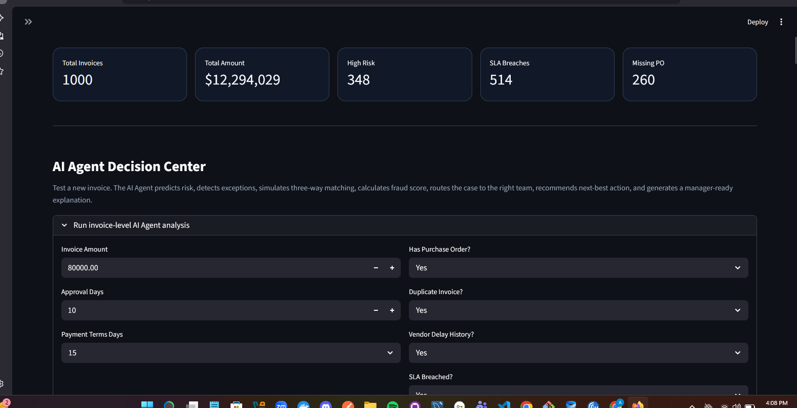
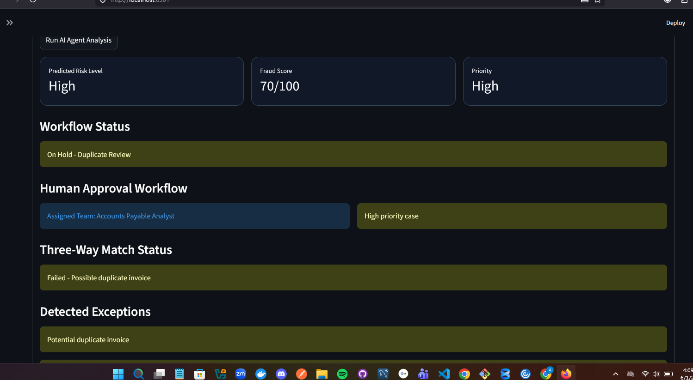
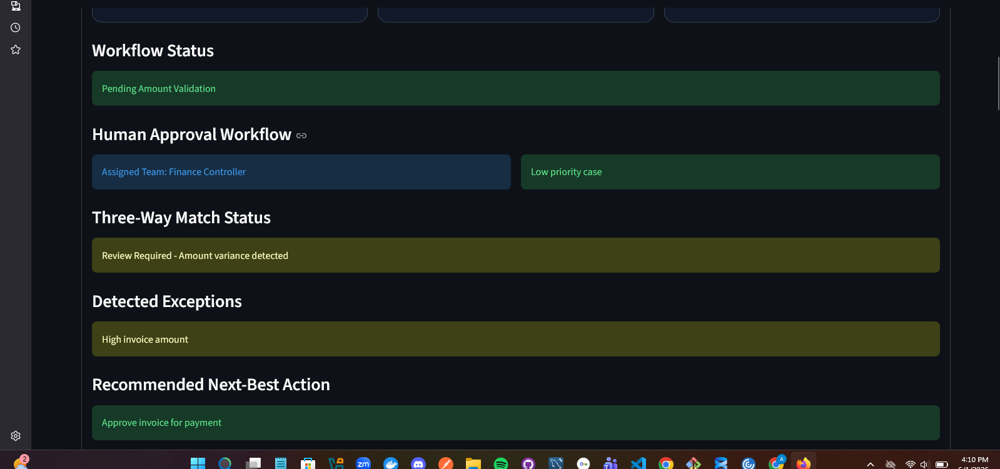
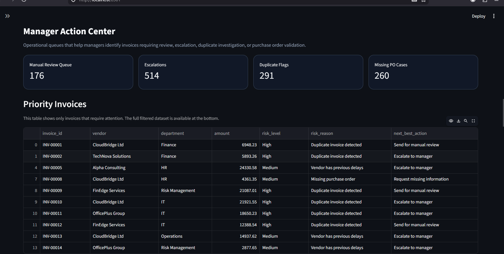

# OpsMind AI — Agentic AI for Invoice Risk Management

OpsMind AI is an end-to-end Agentic AI system built for Accounts Payable (AP) operations. It combines Machine Learning, Generative AI, RAG, and SQL analytics to automatically detect risky invoices, prevent fraud, monitor SLA compliance, and generate manager-ready recommendations.

---

## 🚀 Live Demo

**[opsmind-ai.streamlit.app](https://opsmind-ai.streamlit.app)**

Open the live app directly in your browser — no installation needed.

> **Optional:** Add a free Groq API key in the sidebar to enable GenAI features.
> Get one at [console.groq.com](https://console.groq.com) — no credit card required.

---

## Features

- **AI Agent Decision Center** — ML risk classification + fraud scoring + exception detection + agentic tool use
- **Auto Email Generator** — automatically drafts vendor and manager emails based on detected exceptions
- **Batch Invoice Analyzer** — analyze hundreds of invoices at once, ranked by risk
- **GenAI Assistant** — ask business questions about the invoice portfolio in plain English
- **Natural Language SQL** — convert plain English to SQL and run it on the invoice database
- **Vendor Risk Scorecard** — vendor-level risk profiling with high-risk rate, SLA breach rate, duplicate rate
- **Invoice Segmentation** — KMeans unsupervised ML groups invoices into behavioural segments
- **AP Process Health Score** — single composite score measuring AP process health
- **Approval Time Predictor** — Random Forest Regressor predicts invoice approval time
- **Payment Due Monitor** — invoices approaching due date, sorted by urgency and risk
- **Explainable AI** — feature importance chart showing what drives ML risk decisions
- **Upload Your Own Dataset** — upload any invoice CSV and get a full risk analysis

---

## Tech Stack

- Python
- Scikit-learn (Random Forest Classifier + Regressor, KMeans, PCA)
- Streamlit
- Plotly
- SQLite
- Groq API / Anthropic API
- RAG (TF-IDF retrieval over AP policy documents)
- Pandas / NumPy / SciPy

---

## How to Run Locally

### 1. Clone the repository
```bash
git clone https://github.com/Alisa-Shala/opsmind-ai.git
cd opsmind-ai
```

### 2. Install dependencies
```bash
pip install -r requirements.txt
```

### 3. Run setup — one click
```bash
setup_and_run.bat
```

Or manually step by step:
```bash
py src/generate_dataset.py
py src/data_cleaning.py
py src/load_to_database.py
py src/train_models.py
py -m streamlit run src/app.py
```

### 4. Add API Key (optional — enables GenAI features)
Enter your Groq API key in the sidebar → Apply.
Get a free key at [console.groq.com](https://console.groq.com)

---

## Project Structure

```
opsmind-ai/
├── src/
│   ├── app.py                  # Streamlit dashboard
│   ├── agent.py                # AI Agent (ML + tool use)
│   ├── batch_analyzer.py       # Batch invoice analysis
│   ├── genai_assistant.py      # GenAI chat assistant
│   ├── genai_summary.py        # AI executive summary
│   ├── rag_retriever.py        # RAG policy retrieval
│   ├── generate_dataset.py     # Synthetic dataset generator
│   ├── data_cleaning.py        # Data cleaning pipeline
│   ├── load_to_database.py     # SQLite loader
│   └── train_models.py         # ML model training
├── models/
│   ├── risk_model.pkl          # Risk classifier
│   ├── label_encoder.pkl
│   ├── approval_predictor.pkl  # Approval time regressor
│   └── approval_predictor_features.pkl
├── database/
│   └── opsmind.db              # SQLite database
├── knowledge_base/             # AP policy documents (RAG)
├── data/
│   ├── raw/invoices.csv
│   └── processed/clean_invoices.csv
├── test_invoices.csv           # Sample CSV for upload testing
├── requirements.txt
└── setup_and_run.bat
```

---

## Screenshots

### Dashboard Overview


### AI Agent — High Risk Invoice


### AI Agent — Low Risk Invoice


### Manager Action Center


### Risk Analytics


---

## Business Value

OpsMind AI helps Accounts Payable teams by:
- Reducing manual invoice review effort
- Detecting duplicate invoices before payment
- Flagging missing purchase orders automatically
- Monitoring SLA compliance across all departments
- Routing high-risk cases to the right team
- Generating professional vendor and manager communications
- Providing explainable, data-driven recommendations
