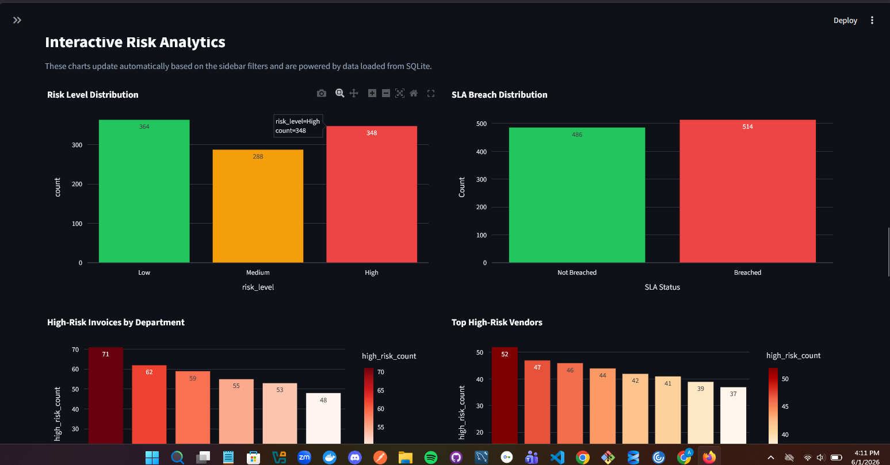

# OpsMind AI — Agentic AI Prototype for Invoice Risk Management

OpsMind AI is a working Agentic AI prototype for invoice risk management and operational decision support.
The project demonstrates how Python, SQL, SQLite, Machine Learning, Explainable AI, and Streamlit can be combined to support invoice processing, risk detection, fraud scoring, SLA monitoring, and manager-ready recommendations.

## Project Overview

Companies process many invoices from different vendors and departments. Some invoices may require additional review because they are missing a purchase order, appear to be duplicates, exceed SLA approval time, have high invoice amounts, or come from vendors with previous delay history.

OpsMind AI simulates an enterprise Accounts Payable workflow where an AI Agent analyzes invoices and recommends the next best action for managers and operations teams.
## How to Run the Project

### 1. Install dependencies

```bash
pip install -r requirements.txt
```

### 2. Generate the dataset

```bash
py src/generate_dataset.py
```

### 3. Clean and process the data

```bash
py src/data_cleaning.py
```

### 4. Load data into SQLite database

```bash
py src/load_to_database.py
```

### 5. Train the Machine Learning model

```bash
py src/train_models.py
```

### 6. Run SQL analytics

```bash
py src/run_sql_queries.py
```

### 7. Start the Streamlit dashboard

```bash
py -m streamlit run src/app.py
```

## Business Problem

Manual invoice review can be slow and error-prone. Finance and operations teams often need to identify:

* High-risk invoices
* Duplicate invoices
* Missing purchase orders
* SLA breaches
* Vendors with delay history
* Invoices that require escalation or manual review

The goal of this project is to reduce manual effort and help managers focus on the invoices that require attention.

## Solution

OpsMind AI provides an end-to-end prototype that includes:

* Synthetic invoice dataset generation
* Data cleaning and feature engineering
* SQLite database storage
* SQL analytics for invoice monitoring
* Machine Learning model for risk classification
* AI Agent for invoice-level decision support
* Fraud score calculation
* Three-way matching simulation
* Human approval workflow routing
* Vendor/AP follow-up message generation
* GenAI-style manager explanation
* Interactive Streamlit dashboard

## How OpsMind AI Works

The project follows this workflow:

```text
Raw Invoice Dataset
        ↓
Data Cleaning & Feature Engineering
        ↓
SQLite Database
        ↓
SQL Analytics + Machine Learning Model
        ↓
AI Agent Decision Workflow
        ↓
Streamlit Dashboard + Manager Recommendations
```

## Agentic AI Workflow

The AI Agent analyzes a new invoice using the following steps:

```text
Invoice Submitted
        ↓
Risk Prediction
        ↓
Exception Detection
        ↓
Fraud Score Calculation
        ↓
Three-Way Matching Simulation
        ↓
Human Approval Routing
        ↓
Next-Best Action Recommendation
        ↓
Manager-Ready Explanation
```

The AI Agent does not only predict risk. It also explains why the invoice is risky, assigns the case to the appropriate team, sets workflow priority, and generates a recommended action.

## Key Features

### 1. Invoice Risk Classification

The Machine Learning model predicts invoice risk as:

* Low
* Medium
* High

### 2. Fraud Score

The AI Agent calculates a fraud score from 0 to 100 based on signals such as:

* Duplicate invoice flag
* Missing purchase order
* High invoice amount
* Vendor delay history
* SLA breach
* Approval delay

### 3. Exception Detection

The system detects common invoice exceptions:

* Potential duplicate invoice
* Missing purchase order
* SLA breached
* Approval delay
* Vendor delay history
* High invoice amount

### 4. Three-Way Matching Simulation

The project simulates a three-way matching process between:

* Purchase Order
* Goods Receipt / Service Confirmation
* Invoice

Possible results include:

* Passed
* Failed - Missing purchase order
* Failed - Possible duplicate invoice
* Review Required - Amount variance detected

### 5. Human Approval Workflow

The AI Agent routes invoices to the right team based on risk and exceptions:

* Standard AP Processing
* AP Analyst
* Accounts Payable Analyst
* Procurement Team
* Operations Manager
* Finance Controller
* AP Manager + Risk/Compliance Team

### 6. Manager Action Center

The dashboard highlights:

* Manual review queue
* Escalations
* Duplicate invoice flags
* Missing purchase order cases
* Priority invoices for manager review

### 7. SQL Analytics

The SQLite database supports SQL analytics such as:

* Risk level distribution
* High-risk invoices by department
* SLA breaches by department
* Duplicate invoice monitoring
* Missing purchase order cases
* Top high-risk vendors
* Manual review queue
* Escalation queue

### 8. Explainable AI

The dashboard includes a feature importance chart that shows which invoice signals influence the ML risk model the most.

### 9. GenAI-Style Manager Explanation

The AI Agent generates manager-ready explanations describing:

* Risk level
* Fraud score
* Detected exceptions
* Three-way matching result
* Workflow status
* Assigned team
* Recommended next-best action

## Tech Stack

* Python
* Pandas
* NumPy
* Scikit-learn
* SQLite
* SQL
* Streamlit
* Plotly
* Matplotlib / Seaborn
* Pickle for model persistence

## Project Structure

```text
opsmind-ai/
│
├── data/
│   ├── raw/
│   │   └── invoices.csv
│   └── processed/
│       └── clean_invoices.csv
│
├── database/
│   └── opsmind.db
│
├── models/
│   ├── risk_model.pkl
│   └── label_encoder.pkl
│
├── reports/
│   └── project_summary.md
│
├── screenshots/
│   ├── dashboard_overview.png
│   ├── ai_agent_low_risk.png
│   ├── ai_agent_high_risk.png
│   ├── manager_action_center.png
│   ├── risk_analytics.png
│   └── feature_importance.png
│
├── sql/
│   └── queries.sql
│
├── src/
│   ├── generate_dataset.py
│   ├── data_cleaning.py
│   ├── load_to_database.py
│   ├── run_sql_queries.py
│   ├── train_models.py
│   ├── agent.py
│   └── app.py
│
├── README.md
└── requirements.txt
```


## Screenshots

### Dashboard Overview


### AI Agent Low Risk Example


### AI Agent High Risk Example


### Manager Action Center


### Risk Analytics



### Feature Importance


## Business Value

OpsMind AI demonstrates how an AI Agent can support invoice operations by:

* Reducing manual invoice review effort
* Detecting risky invoices earlier
* Highlighting duplicate invoice risk
* Monitoring SLA breaches
* Routing cases to the right team
* Supporting manager decision-making
* Providing explainable and actionable recommendations

## Limitations

This project is a prototype and uses synthetic data. It is not connected to a real ERP system, SAP system, production database, or live vendor system.

The GenAI-style explanations are generated using rule-based business logic and not a live LLM API.

## Future Improvements

Possible improvements include:

* Add real ERP/SAP integration
* Add user authentication and role-based access
* Add cloud deployment
* Add real LLM API for manager explanations
* Add Teams or email alerts for escalations
* Add real-time invoice ingestion
* Add approval history tracking
* Add vendor risk scoring over time

## Project Status

This is a working prototype built as a hands-on AI/Data Engineering project.
It demonstrates practical use of Python, SQL, Machine Learning, SQLite, Streamlit, and AI Agent logic for a business-focused invoice risk management use case.
